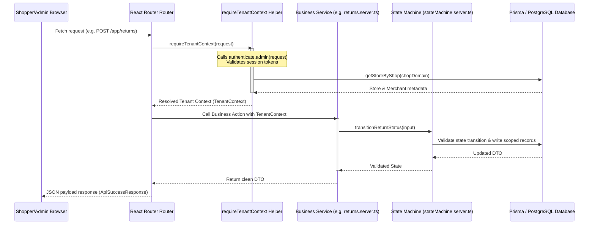

# BYNDCART Backend Architecture Documentation

This document describes the backend architecture, request execution lifecycles, and security models of the BYNDCART post-purchase Returns & Exchanges SaaS app.

---

## 1. Core Architectural Rules (Architecture Freeze)

1. **PostgreSQL + Prisma Operational DB**: Single database authority. All models map through `prisma/schema.prisma`.
2. **Strict Multi-Tenancy**: Every merchant record is scoped via `shopifyStoreId` and verified through `requireTenantContext(request)`.
3. **Shopify Integration Boundary**: UI routes never call Shopify APIs directly; all SDK and GraphQL operations are isolated inside reusable service modules (`app/services/*`).
4. **Provider-Neutral Courier Logistics**: Logistics integration uses `ICourierAdapter` interface and `CourierRegistry` (`app/services/courier.server.ts`).
5. **Authoritative State Machine**: Return and exchange status transitions are governed by `app/services/stateMachine.server.ts` enforcing valid state graphs.
6. **Idempotency & Retry Safety**: External operations and webhooks use idempotency keys, duplicate checks, and retry metadata.
7. **Background Job Queue**: Asynchronous work is enqueued into PostgreSQL via the `BackgroundJob` model (`app/services/jobs.server.ts`).
8. **Robust Webhook Processing**: Webhook routes authenticate signatures, check rate limits, deduplicate via `WebhookEvent.id`, and enqueue `BackgroundJob` records.
9. **Web & Worker Process Separation**: HTTP request lifecycles (React Router) remain isolated from background job worker processes (`app/worker.server.ts` & `scripts/worker.ts`).
10. **Zero Redis Overhead**: PostgreSQL + Prisma and in-memory caches fulfill all queue and rate-limiting needs without introducing Redis.

---

## 2. Request Lifecycle Overview



---

## 3. Background Jobs & Worker Architecture

```
[ Shopify Webhook / Action ]
         ↓
[ webhooks.tsx / Route Action ]
         ↓
[ BackgroundJob Enqueue ] (Persists payload in PostgreSQL with status=PENDING)
         ↓
[ Worker Daemon Process ] (Claims job, runs handler, handles retries/failures)
         ↓
[ External Integrations ] (Shopify Draft Orders / ICourierAdapter Labels)
```

---

## 4. Service Abstractions Layer

- **Tenant Context (`app/services/tenant.server.ts`)**: Session validation and tenant boundary enforcement.
- **State Machine (`app/services/stateMachine.server.ts`)**: Authoritative return/exchange state transition engine.
- **Courier Logistics (`app/services/courier.server.ts`)**: Provider-neutral `ICourierAdapter` interface and registry.
- **Shipments (`app/services/shipments.server.ts`)**: Reverse tracking code mapping and shipping labels registration.
- **Background Jobs (`app/services/jobs.server.ts`)**: Database-backed task queue management.
- **Worker Process (`app/worker.server.ts` & `scripts/worker.ts`)**: Standalone background job execution engine.
- **Store Register (`app/services/store.server.ts`)**: Automatic sync of store attributes upon installation.
- **Audit Logging (`app/services/audit.server.ts`)**: System audit log recording.
- **Transactional Notifications (`app/services/notifications.server.ts`)**: Merchant and customer email dispatch logic.
- **Analytics Aggregation (`app/services/analytics.server.ts`)**: Financial returns performance metrics.
- **Billing (`app/services/billing.server.ts`)**: Shopify subscription billing management.
